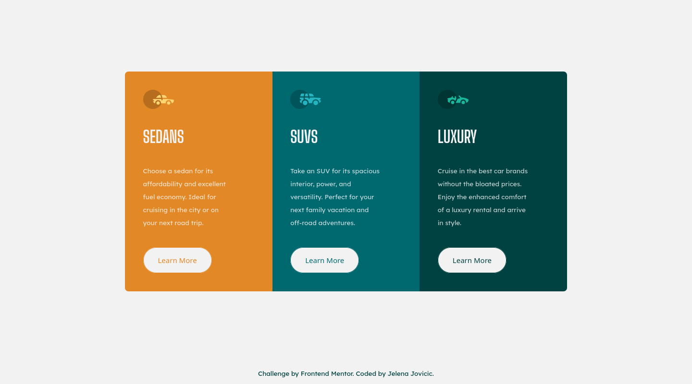

# Frontend Mentor - 3-column preview card component solution

This is a solution to the [3-column preview card component challenge on Frontend Mentor](https://www.frontendmentor.io/challenges/3column-preview-card-component-pH92eAR2-). Frontend Mentor challenges help you improve your coding skills by building realistic projects. 

## Table of contents

- [Overview](#overview)
  - [The challenge](#the-challenge)
  - [Screenshot](#screenshot)
  - [Links](#links)
- [My process](#my-process)
  - [Built with](#built-with)
  - [What I learned](#what-i-learned)
  - [Continued development](#continued-development)
  - [Useful resources](#useful-resources)
- [Author](#author)

## Overview

### The challenge

Users should be able to:

- [x] View the optimal layout depending on their device's screen size
- [x] See hover states for interactive elements

### Screenshot

### Links

- [Repo](https://github.com/je-jo/3-column-preview-card-component-main)
- [Live](https://je-jo.github.io/3-column-preview-card-component-main/)

## My process

### Built with

- Semantic HTML5 markup
- CSS custom properties
- CSS Grid
- Mobile-first workflow

### What I learned

The aim was to stop relying on flexbox so much and use grid instead.

### Continued development

Try not to worry about exact pixels, as working from .jpg is just a pain. Instead, try to learn something new from each challenge.

### Useful resources

- [Minireset](https://awesomeopensource.com/project/jgthms/minireset.css?categoryPage=29) - A tiny modern CSS reset. 

## Author

- [Github](https://github.com/je-jo)
- [Frontend Mentor](https://www.frontendmentor.io/profile/je-jo)
- [Codepen](https://codepen.io/je-jo)

